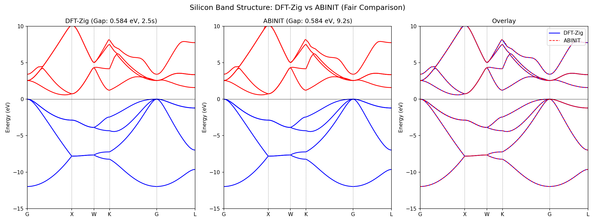
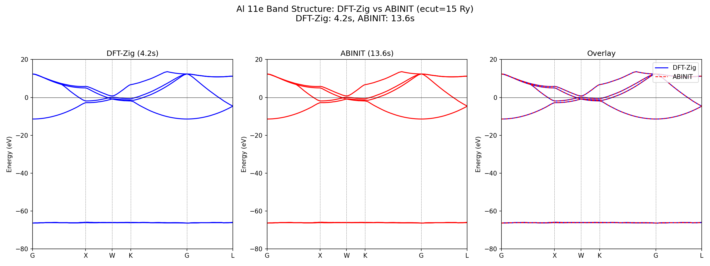
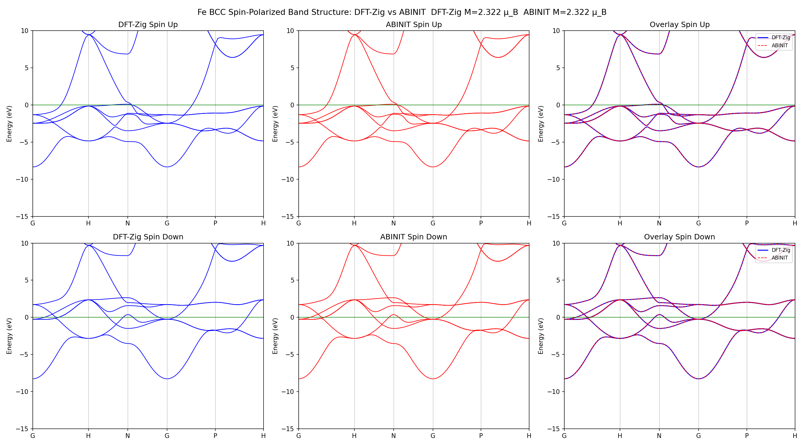

# DFT-Zig

A plane-wave basis density functional theory (DFT) package written in Zig.
Supports periodic systems (crystals) and isolated systems (molecules).

[日本語版 README](README.ja.md)

## Features

### Calculation Types

| Feature | Description |
|---------|-------------|
| **SCF** | Self-consistent field calculation (total energy, electron density, Fermi level) |
| **Band Structure** | Band energies along high-symmetry k-paths |
| **DFPT** | Density functional perturbation theory for phonons (Gamma and finite q-points) |
| **Structural Relaxation** | Atomic positions and lattice optimization (BFGS / CG / steepest descent) |
| **Forces** | Hellmann-Feynman forces (local, nonlocal, Ewald, NLCC, PAW D^hat) |
| **Stress** | Stress tensor and pressure (local, nonlocal, kinetic, Ewald, GGA, NLCC) |
| **Molecular SCF** | Gaussian basis (STO-3G, 6-31G, 6-31G\*\*) Hartree-Fock / DFT |

### Exchange-Correlation Functionals

| Functional | Identifier | Description |
|------------|------------|-------------|
| LDA | `lda_pz` | Perdew-Zunger parametrization |
| GGA | `pbe` | Perdew-Burke-Ernzerhof |

### Pseudopotentials

| Format | Status |
|--------|--------|
| UPF (Norm-Conserving) | Supported |
| UPF (PAW) | Supported (multi-L compensation charges, m-resolved D matrix, Lebedev angular integration) |

### Eigenvalue Solvers

| Solver | Identifier | Description |
|--------|------------|-------------|
| LOBPCG | `iterative` | Iterative block eigenvalue method (recommended) |
| Direct diagonalization | `dense` | LAPACK zheev (for small systems) |

### SCF Mixing

- **Linear mixing**: Simple mixing with `mixing_beta`
- **Pulay/DIIS mixing**: History-based accelerated mixing (`pulay_history`, `pulay_start`)
- **Potential mixing**: Direct V_in/V_out mixing (default, recommended)

### Smearing

- `none`: Fixed occupations
- `fermi_dirac`: Fermi-Dirac distribution

### Symmetry

- Automatic crystal point group detection
- IBZ (irreducible Brillouin zone) k-point reduction
- Time-reversal symmetry

### FFT Backends

| Backend | Description |
|---------|-------------|
| `fftw` | FFTW3 (fastest, recommended) |
| `zig` | Pure Zig implementation |
| `zig_parallel` | Parallel Zig FFT |
| `vdsp` | Apple Accelerate (macOS) |
| `metal` | Metal GPU (macOS) |

### Parallelization

- k-point thread parallelism (SCF, band, DFPT)
- Block parallelism within LOBPCG

### Additional Features

- **van der Waals correction**: DFT-D3(BJ)
- **Cell relaxation**: vc-relax (lattice optimization via stress tensor)
- **Spin polarization**: Collinear (nspin=2)
- **NLCC**: Nonlinear core correction (SCF, DFPT, forces, stress)

## Quick Start

### Prerequisites

- Zig 0.15+
- macOS (Accelerate) or Linux (OpenBLAS)
- FFTW3 (recommended)

### Nix Environment (Recommended)

```bash
nix develop
just build
```

### Manual Build

```bash
# Without FFTW
zig build -Doptimize=ReleaseFast

# With FFTW
zig build -Doptimize=ReleaseFast \
  -Dfftw-include=/path/to/fftw/include \
  -Dfftw-lib=/path/to/fftw/lib
```

### Run

```bash
./zig-out/bin/dft_zig examples/silicon.toml
```

### Test

```bash
just test              # All tests
just test-unit         # Unit tests
just test-regression   # Regression tests (ABINIT/QE comparison)
```

## Configuration

Calculation parameters are specified in TOML format.

```toml
title = "silicon"
xyz = "examples/silicon.xyz"
out_dir = "out/silicon"
units = "angstrom"

[[pseudopotential]]
element = "Si"
path = "pseudo/Si.upf"
format = "upf"

[cell]
a1 = [5.431, 0.0, 0.0]
a2 = [0.0, 5.431, 0.0]
a3 = [0.0, 0.0, 5.431]

[scf]
enabled = true
solver = "iterative"
xc = "pbe"
ecut_ry = 40.0
kmesh = [6, 6, 6]
max_iter = 50
convergence = 1e-6
mixing_beta = 0.3
pulay_history = 8
smearing = "fermi_dirac"
smear_ry = 0.01

[band]
points = 60
nbands = 8
solver = "iterative"
path = "G-X-W-L-G"

[dfpt]
enabled = true
sternheimer_tol = 1e-8
mixing_beta = 0.7

[relax]
enabled = true
algorithm = "bfgs"
force_tol = 0.001

[vdw]
enabled = true
method = "d3bj"
```

### Configuration Sections

| Section | Description |
|---------|-------------|
| `[scf]` | SCF parameters (ecut, kmesh, mixing, convergence) |
| `[band]` | Band structure (k-path, number of bands, solver) |
| `[dfpt]` | DFPT/phonon calculation (Sternheimer, q-points) |
| `[relax]` | Structural relaxation (algorithm, force tolerance) |
| `[ewald]` | Ewald summation parameters |
| `[vdw]` | van der Waals correction (D3-BJ) |
| `[[pseudopotential]]` | Pseudopotential specification (multi-element) |

### Config Validation

DFT-Zig validates configuration before starting calculations. Three severity levels:

- **ERROR** — Invalid config, calculation aborted (missing files, degenerate cell, invalid parameter ranges, incompatible settings like DFPT+smearing)
- **WARNING** — Suspicious settings that may produce poor results (grid too small for ecut, nspin=2 without spinat, loose convergence)
- **HINT** — Performance recommendations based on benchmarks (use fftw, iterative solver, diemac, Pulay mixing, potential mixing, symmetry)

Example output:
```
[WARNING] [scf.grid] grid [8,8,8] is smaller than recommended [17,17,17] for ecut_ry=15.0; use grid = [18,18,18] or set grid = [0,0,0] for auto
[HINT] [scf.fft_backend] fft_backend = "fftw" is recommended for production calculations
```

## Output

Results are written to `out_dir`.

| File | Contents |
|------|----------|
| `band_energies.csv` | Band energies (k-points x bands) |
| `kpoints.csv` | k-point coordinates |
| `scf.log` | SCF convergence history |
| `run_info.txt` | Input parameter summary |

## Validation

Validated against ABINIT 10.4.7 and Quantum ESPRESSO in `benchmarks/`.

### Si — Semiconductor (NC-PP, LDA, ecut=15 Ry, 4x4x4 k-mesh)

DFT-Zig vs ABINIT — band gap difference < 1 meV



### Al 11e — Metal with semi-core states (NC-PP, PBE, ecut=30 Ry, 6x6x6 k-mesh)

DFT-Zig vs ABINIT — max band difference 3.2 meV



### Fe BCC — Spin-polarized metal (NC-PP, PBE, ecut=40 Ry, 8x8x8 k-mesh)

DFT-Zig vs ABINIT — spin-up/down band structures



### Full validation matrix

| System | Conditions | Validation |
|--------|------------|------------|
| Si (NC) | LDA, ecut=15 Ry | Band structure, total energy, EOS |
| Si (PAW) | PBE, ecut=44 Ry | Band structure, forces, stress (vs QE) |
| Graphene | LDA, ecut=15 Ry | Band structure (Dirac point) |
| GaAs | PBE, ecut=30 Ry | Band gap, semi-core d bands |
| Cu | PBE, ecut=40 Ry | Metallic band structure |
| Fe BCC | PBE, ecut=40 Ry | Spin-polarized bands, magnetization |
| Al | PBE, ecut=15 Ry | Metallic band structure (Fermi-aligned) |
| Al 11e | PBE, ecut=30 Ry | Semi-core + valence bands |
| Si DFPT | LDA, 2x2x2 k | Phonon: 754.83 vs ABINIT 754.73 cm^-1 |
| Molecules | B3LYP/6-31G** | Total energy (PySCF comparison, 9 molecules) |

## Unit System

- Internal units: **Rydberg** (1 Ry = 13.6057 eV)
- Input coordinates: angstrom or bohr (specified by `units`)
- Stress output: GPa

## Project Structure

```
src/
├── main.zig                  # CLI entry point
├── features/
│   ├── config/               # TOML config parser
│   ├── scf/                  # SCF loop
│   ├── band/                 # Band structure
│   ├── dfpt/                 # Density functional perturbation theory
│   ├── relax/                # Structural relaxation
│   ├── forces/               # Force calculation
│   ├── stress/               # Stress tensor
│   ├── paw/                  # PAW implementation
│   ├── pseudopotential/      # UPF pseudopotentials
│   ├── hamiltonian/          # Hamiltonian construction & application
│   ├── symmetry/             # Point group & space group
│   ├── xc/                   # Exchange-correlation functionals
│   ├── kpoints/              # k-point mesh
│   ├── fft/                  # FFT management
│   ├── gto_scf/              # Gaussian basis molecular SCF
│   ├── vdw/                  # van der Waals correction
│   └── linalg/               # Eigenvalue solvers (LOBPCG etc.)
├── lib/
│   ├── fft/                  # FFT library
│   ├── linalg/               # BLAS/LAPACK wrappers
│   └── gpu/                  # Metal GPU bridge
benchmarks/                   # Validation & benchmarks
examples/                     # Example config files
pseudo/                       # UPF pseudopotentials
```

## Justfile Commands

```bash
just build            # Build (ReleaseFast)
just test             # Run all tests
just test-unit        # Unit tests only
just test-regression  # Regression tests (ABINIT/QE comparison)
just fmt              # Format source code
```

## Pseudopotentials

Pseudopotential files are not included in the repository.
UPF format (Norm-Conserving or PAW) is supported. Place UPF files in the `pseudo/` directory.

## License

MIT
