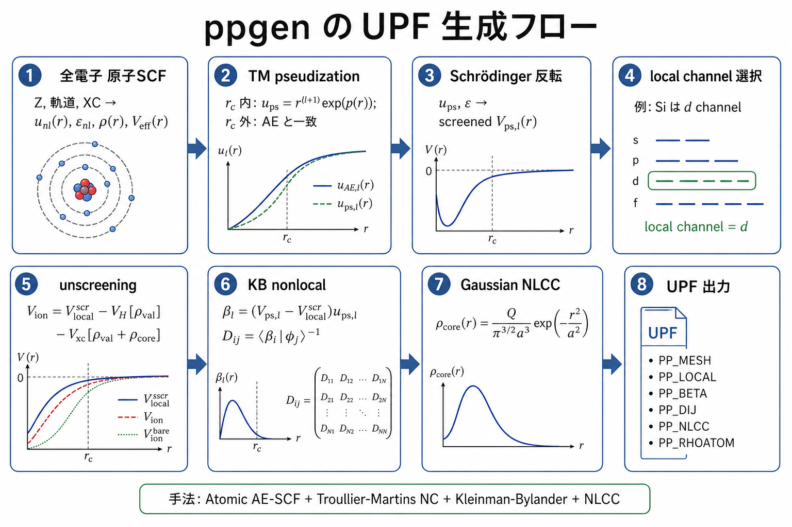

# ppgen

`ppgen` generates UPF norm-conserving pseudopotentials from an atomic
all-electron calculation. The current implementation is aimed at making the
generation path explicit and regression-testable before moving toward more
advanced optimization schemes.



## Method

The current generator uses:

- atomic all-electron SCF on a radial grid
- Troullier-Martins norm-conserving pseudization
- radial Schrodinger-equation inversion for channel potentials
- smoothed local potential construction
- Kleinman-Bylander separable nonlocal projectors
- AE-core-derived nonlinear core correction (NLCC)
- UPF output with `PP_LOCAL`, `PP_BETA`, `PP_DIJ`, `PP_NLCC`, and `PP_RHOATOM`

This is not an ONCV generator. In particular, residual kinetic energy
optimization and the ONCV-style objective are not implemented yet.

## Silicon Ratchet

The Si PBE benchmark is the current quantitative ratchet for ppgen:

```sh
just test-ppgen-silicon
```

The benchmark generates a Si UPF, runs DFT-Zig SCF and bands, then compares the
VBM-aligned bands against the saved ABINIT baseline. More details are in
[`../benchmarks/silicon/README.md`](../benchmarks/silicon/README.md) and
[`../docs/ppgen-notes.md`](../docs/ppgen-notes.md).
